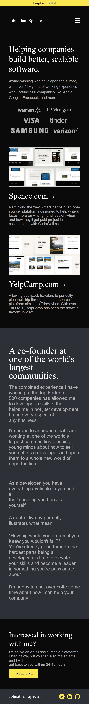

# Johnathan Specter

Uma UI de um portfólio de projetos.

## Autores

- [@joaoquinto](https://github.com/joaoquinto)

## Stack utilizada

**Front-end:** HTML5, CSS3, Javascript

**Design:** AdobeXD

**Monitoramento:** Google Analytics

## Screenshots

### Mobile Screenshot

### Desktop Screenshot

## Licença

[MIT](https://github.com/joaoquinto/johnathan-specter/blob/main/LICENSE)
